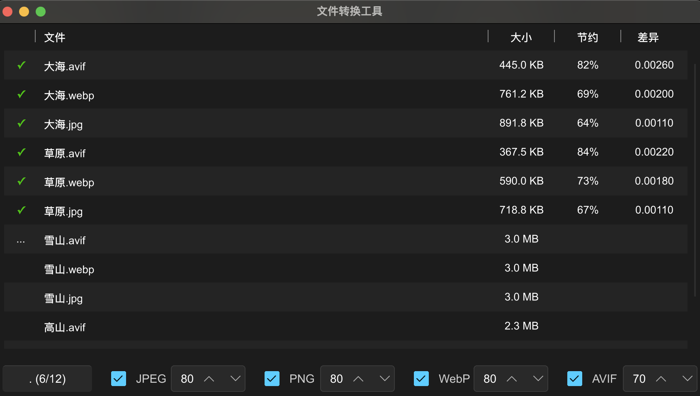

# image-converter

图片转换器，支持`jpeg`, `png`的压缩以及转换为对应的`webp`或`avif`。`avif`为了更好的压缩效果，因此选择的是最低速度，其速度会较慢。

需要注意，图片处理会覆盖原有文件，对于已有`jpeg`或`png`图片，如果无读写权限会增加读写权限。

程序日志文件可查看`~/.image-converter/image-converter.log`

## 功能说明

选择目录后则根据是否勾选了`jpeg`与`png`选项，读取该目录下所有符合的图片。若勾选了对应的`webp`或`avif`，则会将对应的图片转换，每种图片的压缩质量可按需要选择。

表格中的栏目均较为直观，其中最后一项`差异`用于计算转换压缩后的图片与原图片的差异，个人感觉千分之五以内肉眼较难区分。

## TODO

- [*] 图片需要有读写权限
- [*] 日志输出至文件